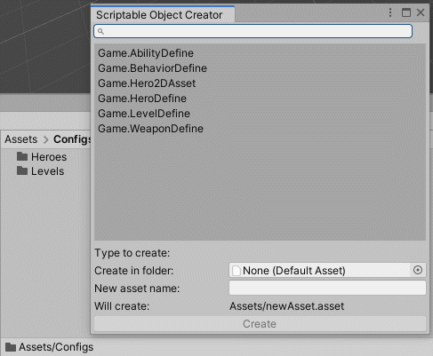

## Unity Scriptable Object Creator

A super handy window for quick creation of any type of Unity Scriptable Object assets

## Usage

Clone this repository and copy it to your project folder, or add `https://github.com/aillieo/ScriptableObjectCreator.git#upm` as a dependency in the Package Manager window.
